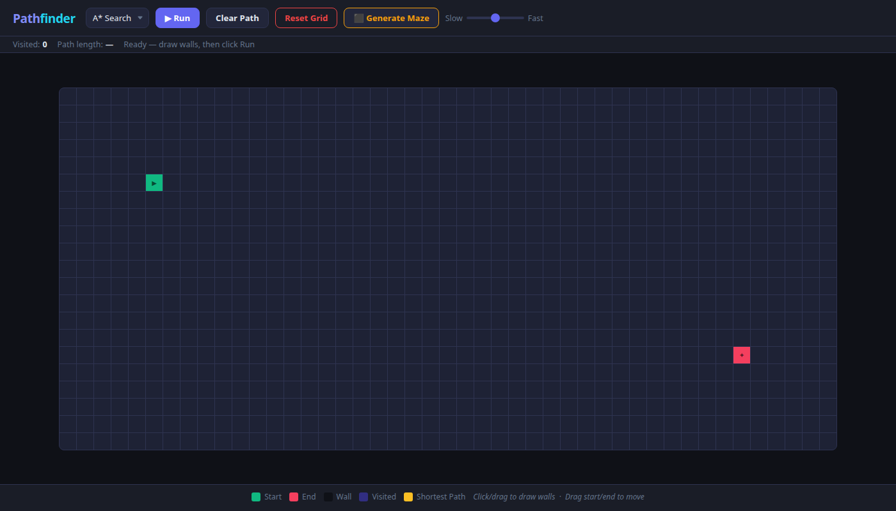
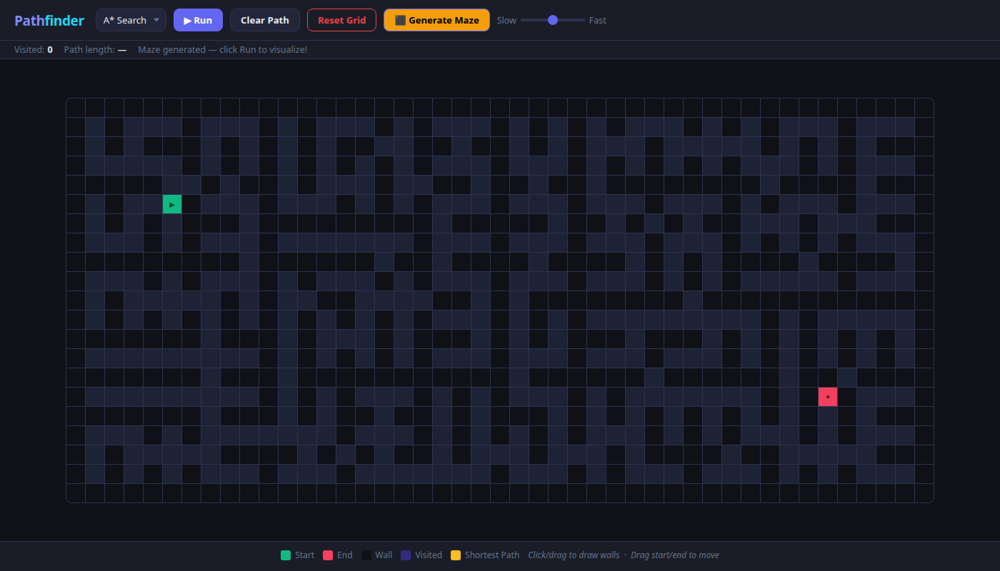
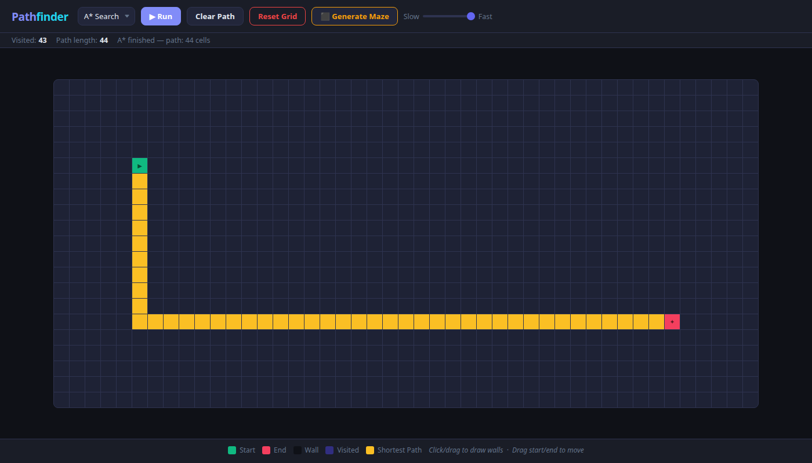

# Pathfinding Visualizer

An interactive pathfinding algorithm visualizer built as a single `index.html` — no build step, no dependencies.

> **Live demo:** [tbarak2.github.io/pathfinding-visualizer](https://tbarak2.github.io/pathfinding-visualizer/)

---

## Screenshots

| Empty grid | Generated maze |
|:---:|:---:|
|  |  |

| A\* shortest path result |
|:---:|
|  |

---

## How to Run

```bash
# Clone the repo
git clone https://github.com/tbarak2/pathfinding-visualizer.git
cd pathfinding-visualizer

# Just open the file — no server needed
open index.html        # macOS
xdg-open index.html   # Linux
start index.html       # Windows
```

Or drag `index.html` into any browser window.

---

## How to Use

| Action | How |
|---|---|
| Draw walls | Click and drag on the grid |
| Erase walls | Click and drag on an existing wall |
| Move start/end | Drag the green (▶) or red (✦) node |
| Generate a maze | Click **⬛ Generate Maze** |
| Run an algorithm | Select from the dropdown, then click **▶ Run** |
| Clear the path | Click **Clear Path** (keeps walls) |
| Reset everything | Click **Reset Grid** |
| Control speed | Use the **Slow → Fast** slider |

---

## Algorithms

### A* Search
A* is a best-first search algorithm that uses a heuristic (Manhattan distance) to guide the search toward the goal. It is both **complete** (always finds a path if one exists) and **optimal** (finds the shortest path). It is typically faster than Dijkstra because it avoids exploring unnecessary directions.

- **Time complexity:** O(E log V) in practice
- **Guarantees shortest path:** ✅

### Dijkstra's Algorithm
Dijkstra explores nodes in order of their cumulative distance from the start. It fans out in all directions uniformly. Since all edge weights here are 1, it behaves identically to BFS but is shown separately to illustrate the concept.

- **Time complexity:** O((V + E) log V)
- **Guarantees shortest path:** ✅

### BFS (Breadth-First Search)
BFS explores all neighbors at the current depth before going deeper. On an unweighted grid it always finds the shortest path. It is the simplest of the three algorithms.

- **Time complexity:** O(V + E)
- **Guarantees shortest path:** ✅ (unweighted graphs only)

---

## Features

- **Three algorithms:** A\*, Dijkstra, BFS
- **Step-by-step animation** with smooth CSS keyframe effects
- **Speed control** — 5 levels from slow (80ms/step) to fast (2ms/step)
- **Recursive division maze generator**
- **Draggable** start and end nodes
- **Wall drawing** via click-drag (desktop) and touch (mobile)
- **Dark theme** with color-coded legend
- **Stat bar** showing visited cell count and path length
- Zero dependencies — pure HTML/CSS/JS

---

## Color Legend

| Color | Meaning |
|---|---|
| 🟢 Green | Start node |
| 🔴 Red | End node |
| ⬛ Dark | Wall |
| 🟣 Purple | Visited cell |
| 🟡 Yellow | Shortest path |

---

## Project Structure

```
pathfinding-visualizer/
├── index.html   # Everything — grid state, algorithms, rendering, UI
└── README.md
```

The code inside `index.html` is organized into clearly labeled sections:

1. **Grid State** — node data structure, init, reset
2. **DOM / Rendering** — build grid DOM, render cell states
3. **Mouse / Touch Interaction** — wall drawing, node dragging
4. **Algorithms** — `runAstar()`, `runDijkstra()`, `runBFS()`, `buildPath()`
5. **Animation** — `animate()`, `animatePath()` using `setTimeout` chains
6. **Maze Generator** — recursive division
7. **Button Handlers** — wires UI to logic

---

Made with ❤️ — pure vanilla JS, no frameworks.
